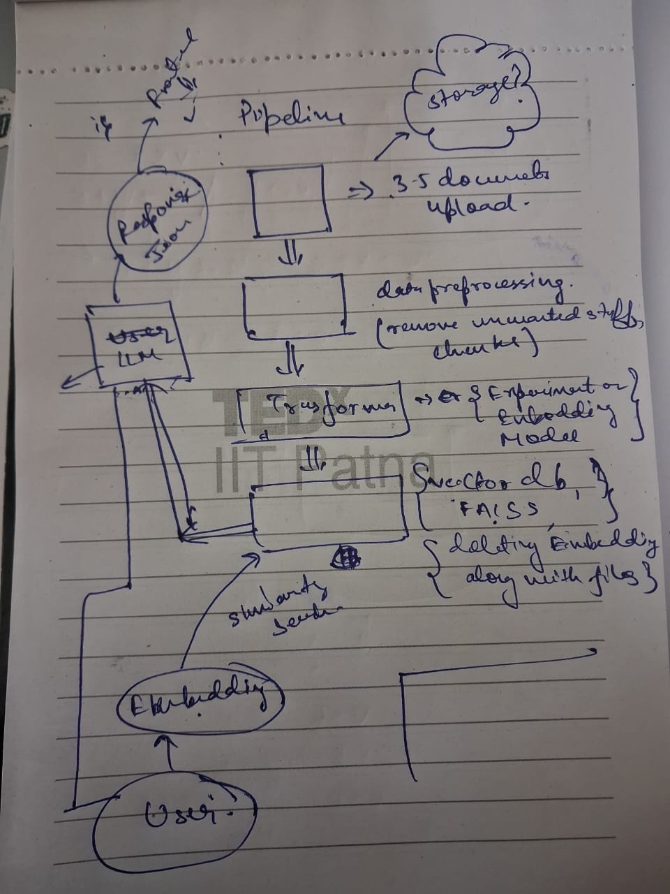

# Medical Based RAG Chatbot

## Overview

This project implements a Retrieval Augmented Generation (RAG) based question answering system using a Python backend and a React frontend on Medical based documents.  


Documents are converted into embeddings and stored in a vector database. For each user query, relevant document chunks are retrieved using semantic similarity search and passed to an LLM to generate the final response.

---

## Tech Stack Used

- Frontend: React  
- Backend: Python  
- Embedding Model: Lightweight transformer-based sentence embedding model  
- Vector Database: FAISS  
- LLM: Open-source Hugging Face 
- Caching: In-memory

---

## Pipeline Structure

The system is divided into two main components:
1. Document ingestion and Text preprocessing
2. Query processing and answer generation

---

### 1. Document Ingestion and Text Processing

This pipeline runs when documents are uploaded or updated.

Steps involved:
1. Documents (PDFs / text files) are uploaded and stored locally.
2. Text is extracted from the documents.
3. Preprocessing is applied:
   - Removal of unwanted text and noise
   - Basic cleaning and normalization
   - Chunking with a fixed overlap
4. Each chunk is converted into an embedding using a transformer model.
5. The embeddings are stored in a FAISS vector database along with document metadata.

---

### 2. Query Processing and Answer Generation

This pipeline runs for every user query.

Steps involved:
1. User enters a query from the React frontend.
2. Backend checks the cache for an existing response.
3. If a cached response exists, it is returned directly.
4. If not cached:
   - The query is converted into an embedding.
   - FAISS performs semantic similarity search to retrieve top-K relevant chunks.
   - Retrieved chunks are combined with the query to form a structured prompt.
   - The prompt is sent to the LLM for response generation.
5. The generated response is stored in cache.
6. Final answer is sent back to the React frontend.

---

## End-to-End Pipeline Diagram

```
User Documents
      |
      v
Text Extraction
      |
      v
Preprocessing & Chunking
      |
      v
Embedding Model
      |
      v
FAISS Vector Database
      |
      | (Semantic Search)
      v
Relevant Chunks
      |
      v
Prompt Construction
      |
      v
LLM
      |
      v
Response Cache
      |
      v
React Frontend
```

---

## Caching Logic

- Cache is checked before performing vector search and LLM inference.
- Repeated or frequently asked queries are served directly from cache.
- This reduces response time and avoids unnecessary LLM calls.
- Cache entries are refreshed when documents are re-ingested.

---

## Prompt Structure

The prompt sent to the LLM includes:
- User query
- Retrieved document chunks
- Clear instruction to answer only from the provided context


This ensures the response stays relevant to the uploaded documents.

---

### Short Description (for evaluation panel)
A Python-based RAG system with a React frontend that uses FAISS for semantic search, caching for faster responses, and an LLM to generate answers grounded in uploaded documents.

## Our Roughwork
